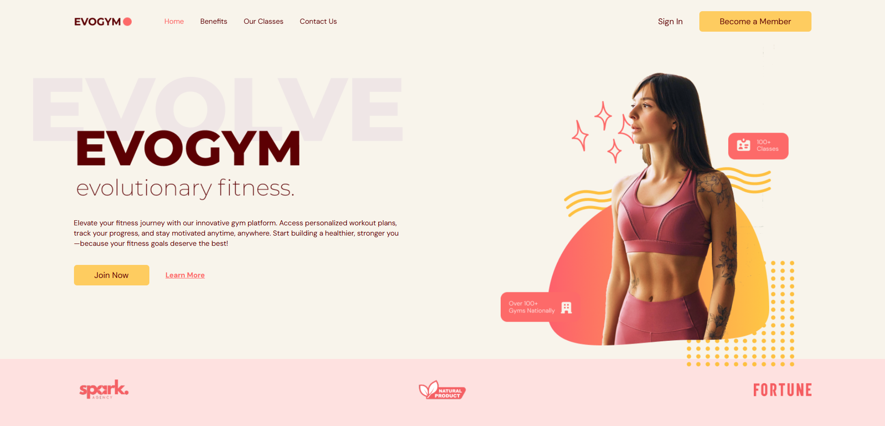
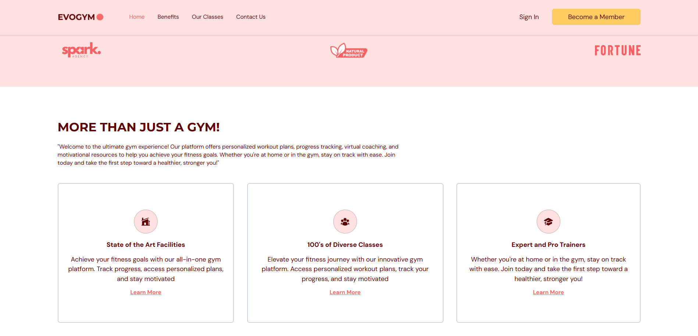
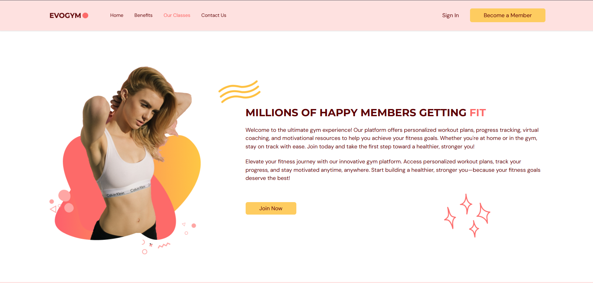
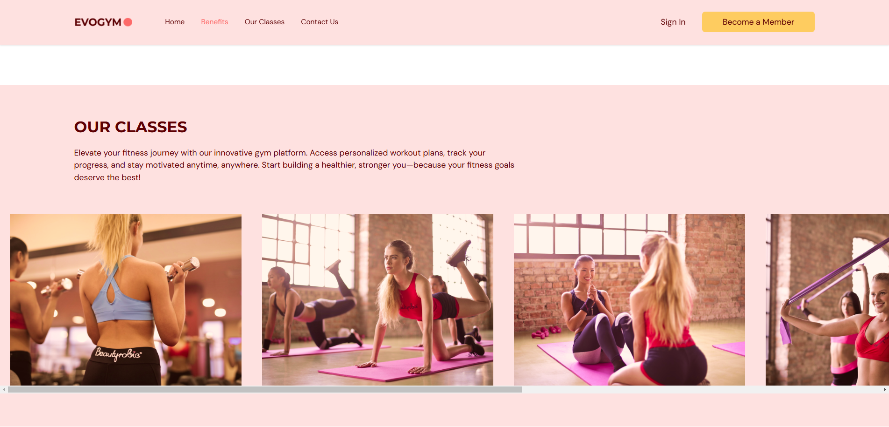
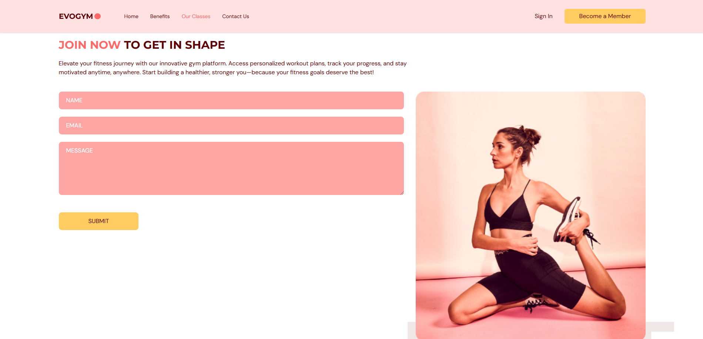
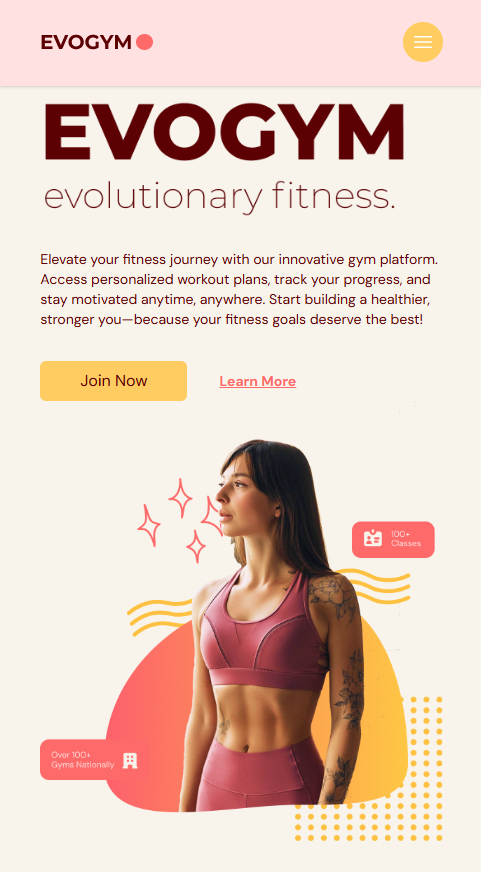
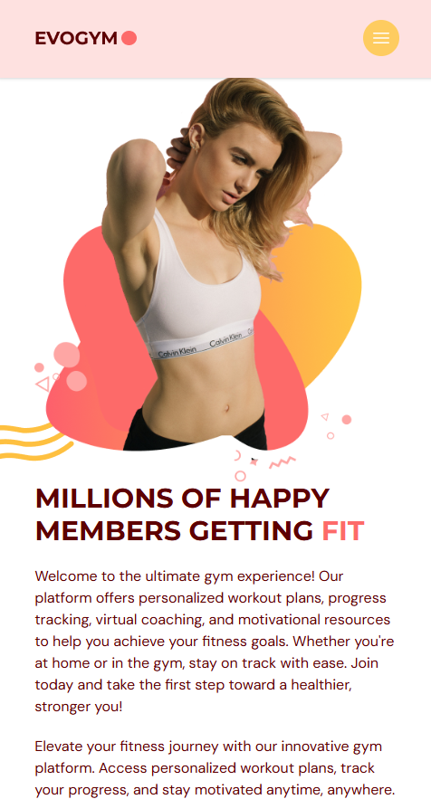

# Gym Portfolio Application 🏋️‍♂️

Welcome to the Gym Portfolio Application! This project is a sleek and responsive portfolio for gyms, showcasing essential sections like **Home**, **Benefits**, **Our Classes**, and **Contact Us**. Built with cutting-edge technologies, it provides an excellent user experience.

---

## Features ✨

- **Home**: A welcoming hero section with an engaging introduction.
- **Benefits**: Highlights the key advantages of choosing this gym.
- **Our Classes**: Showcases various classes available.
- **Contact Us**: Easy-to-use form for inquiries and contact details.

---

## Technologies Used 🛠️

- **Frontend**: React, TypeScript
- **Styling**: Tailwind CSS
- **Build Tool**: Vite
- **Icons**: Hero Icons
- **Fonts**: Google Fonts
- **Animations**: Framer Motion

---

## Screenshots 📸

## Web View
<table>
  <tr>
    <td></td>
    <td></td>
  </tr>
  <tr>
   <td></td>
   <td></td>
  </tr>
   <tr>
   <td></td>
  </tr>
</table>

## Mobile View
<table>
   <tr>
   <td></td>
   <td></td>
  </tr>
</table>

> **Note:** Ensure all screenshots are placed in the `screenshots` folder in the project directory.

---

## Installation & Usage 🚀

1. Clone the repository:
   ```bash
   git clone https://github.com/AminduBhashana/gym_react_typescript_application.git
   cd gym_react_typescript_application

2. Install dependencies:
   ```bash
   npm install

3. Start the development server:
   ```bash
   npm run dev

4. Open your browser at `http://localhost:5173`

### 🌟 Thank you for exploring the Gym Portfolio Application! Ready to elevate your fitness journey? 💪
